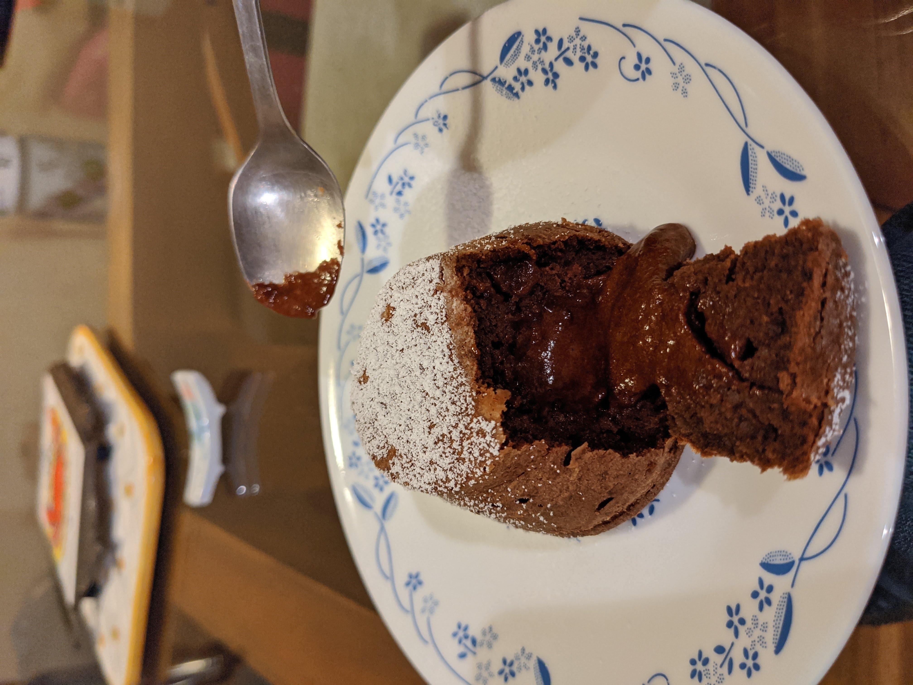

Lava Cake
======
Lava cake receipe can make 6-7 single serving lava cakes depending on baking cup size

## Ingredients
* 62.5g chocolate (90% or greater)
* 62.5g butter (un-salted)
* 2 eggs
* 50g flour (all purpose)
* 50g sugar

## Tools
* mixing bowl
* food scale
* small pot
* oven
* spatula 
* whisk
* cupcake baking cups

## Steps
1. In a small pot melt chocolate and butter, use double boiler method to reduce risk of burning butter
2. Whisk eggs and sugar in a mixing bowl, mix until eggs and sugar are fully integrated
3. Mix the chocolate/butter (ganache) into the eggs/sugar
4. Slowly add flour into the combined mixture, fold in the flour do not mix
5. Evenly distribute mixture into 7-8 small cupcake baking cups
6. Place cups into frdige for 1-2 hours
7. Bake for 7-8min at 400F

## Additional Notes
*

## Common Questions
*

## References
*
