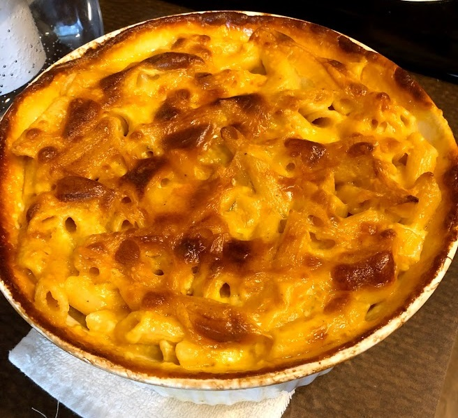

Mac and Cheese
======

Simple Mac and Cheese recipe from Adam Ragusea. Good base recipe and very straight-forward to make.

## Ingredients
Makes 4 servings
- 1 lb pasta shells
- 1 qt whole milk
- 1 lb Kraft Deli Deluxe American Cheese
- 1 stick of salted butter
- Salt
- Pepper

## Tools
- 1 pot for cooking pasta
- 1 pan for making the sauce
- 2.5 qt baking dish
- Colander
- Spatula or wooden spoon
- Aluminum Foil
- (Optional) Baking sheet

## Steps
1. Preheat oven to 350 &deg;F
1. Cut cheese slices into quarters for faster cooking
### Pasta
1. In pot, bring water to boil
1. Salt the boiling water to prevent pasta from sticking
1. Add 1 lb of pasta.
1. Cook for 5 minutes.
1. Drain with colander and set aside
### Sauce
1. In pan over medium heat, pour in the quart of whole milk
1. Add cheese quarters into mixture
1. Add butter to mixture
1. Stir with spatula until everything is melted and combined (about 5-10 minutes)
1. Salt and pepper to taste
### Bake
1. Oil or spray the baking dish to prevent ingredients from sticking
1. Add pasta into the baking dish
1. Add cheese mixture into baking dish
1. Stir to incorporate the pasta and cheese
1. (Optional) Place baking dish on baking tray to collect any possible leakage over the top during baking.
1. Cover the dish with aluminum foil. The foil makes the dish bake more evenly.
1. Put into oven for 45 minutes.
1. If you had a foil cover, remove the cover.
1. Continue cooking in oven for 30 minutes.
1. Remove from oven and rest for 30 minutes.

## Notes
You could bake this without the aluminum foil, but I found that the [resulting dish](images/mac-n-cheese-uncovered.jpg) comes out a bit burned at the top. The top was not any crispier either. Instead, just set the broiler on at the end to finish with a crispier top.

To spice up this recipe, do any/all of the following:
* Change the cheese sauce to use higher quality cheeses. Semi-firm cheese works well. Mix with sodium citrate additive as an emulsifier.
* Add a crispy topping like breadcrumbs during the baking process.
* Add extra spices/ingredients into the body of the mac and cheese.

## Common Questions
* Why use Kraft Deli Deluxe American Cheese?
   * Kraft Deli Deluxe American Cheese contains emulsifiers that thicken the cheese sauce. The emulsifiers help create a very smooth texture that is more difficult to replicate using a roux.

## References
* Adam Ragusea's Simple Mac and Cheese Recipe - https://www.youtube.com/watch?v=9iP1QXFWYkA
* Adam Regusea's Sodium Citrate Mac & Cheese Recipe - https://www.youtube.com/watch?v=KcM_MZoJWOo
* Gavin Webber's Making Homemade Sodium Citrate - https://www.youtube.com/watch?v=UTGzLor4k4M
