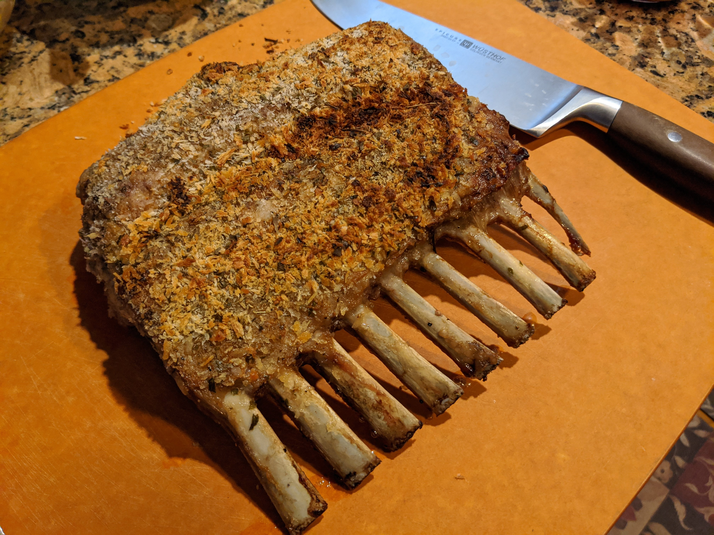

Rack of Lamb
======
baked rack of lamb with a mint and rosemary crust

## Ingredients
* full rack of lamb
* 10 leaves of fresh mint
* 3 sprigs of fresh rosemary 
* 3 table spoon of dijon mustard
* 1/2 cup of bread crumb (or panko)
* 2 cloves of garlic
* salt and pepper

## Tools
* 1 oven safe fry-pan
* oven
* knife or food processor to cut herbs
* food brush

## Steps
1. use paper towel to pad dry rack of lamb
2. season rack of lamb with salt and pepper
3. sear the rack of lamb on all sides (1-2min per side) until brown, then set aside
4. brush dijon mustard rack of lamb, make sure to cover thoroughly 
5. chop mint, rosemary and garlic and combine with bread crumb
6. coat the rack of lamb with the herb and bread crumb
7. pre-heat oven to 450 F
8. bake for 10min, then reduce heat to 300 F bake for 5-10min (5min = medium rare, 10min = medium)

## Additional Notes
*

## Common Questions
*

## References
*
