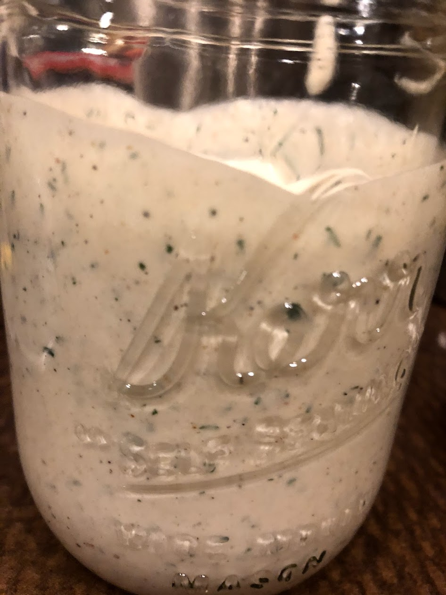

Ranch Dressing (using Greek Yogurt)
======

## Ingredients
* 1/2 cup greek yogurt
* 1/4 cup mayonnaise
* 2 teaspoons granulated garlic
* 1 teaspoon granulated onion
* 2 whole garlic cloves, finely minced or pressed through a garlic press
* 1/4 cup minced fresh dill or 2 teaspoons dried dill
* 1 teaspoon freshly ground black pepper
* 2 tablespoons minced fresh chives or 2 teaspoons dried chives
* 1 tablespoon juice from 1 lemon or lime
* Pinch cayenne or other hot pepper powder
* Salt to taste
* (Optional) Pinch of MSG

## Tools
* Knife
* Jar
* Mixing Bowl
* Whisk

## Steps
1. Finely mince the dill and chives. Add to mixing bowl.
1. Add 1/2 cup of greek yogurt into bowl.
1. Add 1/4 cup of mayo to bowl.
1. Add black pepper to bowl.
1. Roughly mince fresh garlic and add to bowl.
1. Add granulated onion and granulated garlic to bowl.
1. Add lemon/lime to bowl
1. Add pinch of cayenne
1. (Optional) Add MSG
1. Add salt
1. Mix to taste

## References
* https://www.youtube.com/watch?v=p8nJIiQo7jw
